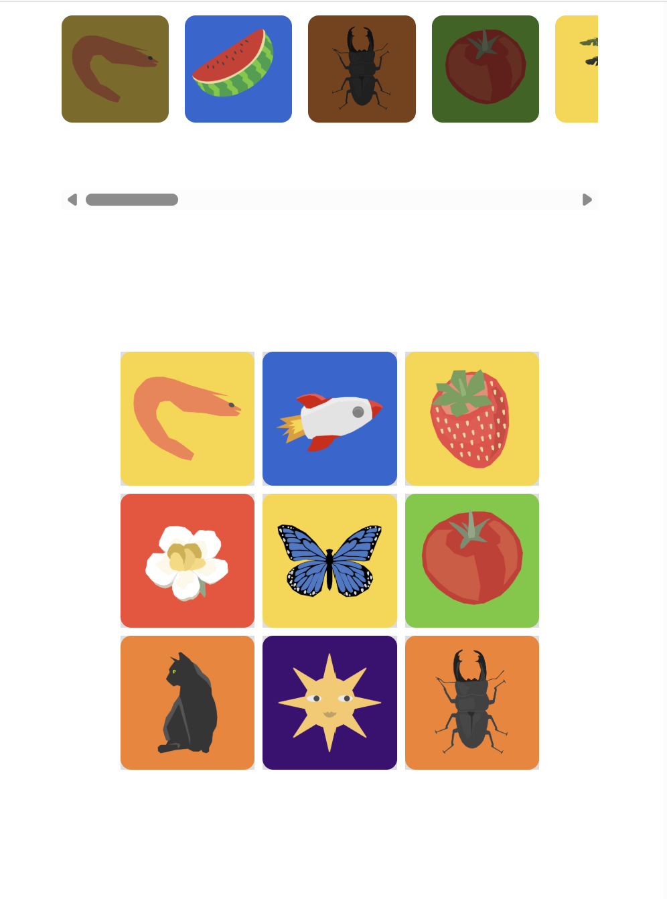

# TileBoard

## Overview
A React-based drag-and-drop tile board project. Users can select colorful tiles from a carousel and arrange them on a 3x3 grid. Tiles can also be dragged back to the selection area. The project supports both mouse and touch interactions and includes a custom drag ghost image for a smooth user experience.
## Preview

## Features
- **Drag-and-drop tiles**: Move tiles from the carousel to the grid and vice versa.
- **3x3 droppable grid**: Tiles can be placed in any square, swapping positions if the square is occupied.
- **Carousel navigation**: Scroll through available tiles with responsive left/right arrows.
- **Custom drag layer**: Shows a semi-transparent image of the dragged tile following the cursor/finger.
- **Responsive design**: Adapts to mobile and desktop screens, showing 5 tiles on small devices and 8 on larger screens.
- **Touch support**: Works with touch devices using `react-dnd-touch-backend`.
- **Preloaded images**: Ensures smooth dragging without lag.

## Instructions
1. Install dependencies
```npm install```
2. Start development server
```npm start```

## Usage

Drag tiles from the carousel to any square in the 3x3 grid.

Drag tiles back to the droppable area outside the grid to return them to the carousel.

Use the left/right arrows to scroll through tiles in the carousel.

On small devices, the carousel shows 5 tiles; on larger screens, it shows 8 tiles.

